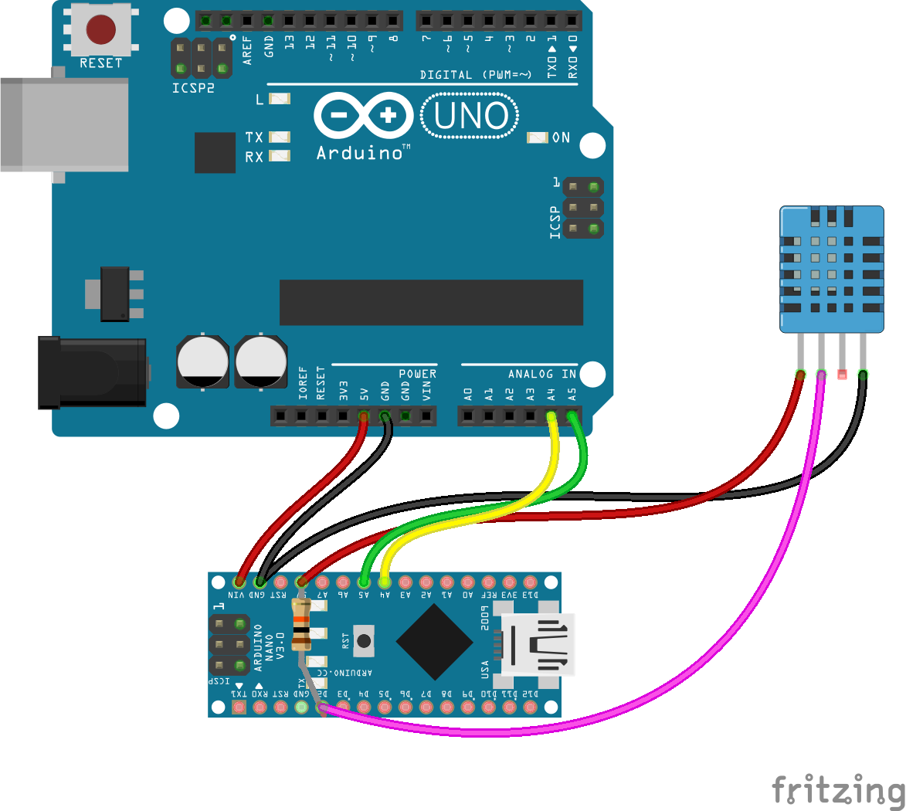

## Ejemplo Higrometro DHT11

Este ejemplo usa [backpacking](../i2c_backpack) para poder acceder a un dispositivo no soportado nativamente por **Johnny Five**. 

### Cableado


### Codigo JS
```javascript
const five = require('johnny-five');

let board = new five.Board();

board.on('ready', () => {

    let dht11 = new five.Thermometer({
        controller: 'DHT11_I2C_NANO_BACKPACK'
    });

    dht11.on('change', () => {
        console.log(`${dht11.celsius}°C`);
        console.log(`${dht11.humidity}%`);
    });
});
```

### Codigo Backpack (Arduino)
```C
#include <Wire.h>
#include "DHT.h"

#define DEBUG_MODE 0

// Address Pins
#define AD0 11
#define AD1 12

// I2C Defaults
#define I2C_DEFAULT_ADDRESS 0x0A
#define I2C_BUFFER_SIZE 4
//
// 0 H LSB
// 1 H MSB
// 2 T LSB
// 3 T MSB
//
byte buffer[I2C_BUFFER_SIZE];

int addressPins[] = { AD0, AD1 };
int address = I2C_DEFAULT_ADDRESS;

int dhtPin = -1;
int dhtType = -1;

void resetState() {
  digitalWrite(dhtPin, LOW);
  pinMode(dhtPin, INPUT);
}

void setup() {

  int offset = 0;

  for (int i = 0; i < 2; i++) {
    pinMode(addressPins[i], INPUT);
    if (digitalRead(addressPins[i])) {
      offset |= 1 << i;
    }
  }

  address += offset;

  #if DEBUG_MODE
    Serial.begin(9600);
  #endif

  resetState();

  Wire.begin(address);
  Wire.onRequest(onRequest);
  Wire.onReceive(onReceive);
}

void loop() {
  if (dhtPin != -1 && dhtType != -1) {
    DHT dht(dhtPin, dhtType);
    dht.begin();

    int h = (int)((float)dht.readHumidity() * 100);
    int c = (int)((float)dht.readTemperature() * 100);

    buffer[0] = h >> 8;
    buffer[1] = h & 0xFF;
    buffer[2] = c >> 8;
    buffer[3] = c & 0xFF;

  #if DEBUG_MODE
    Serial.print("h: ");
    Serial.println(h);
    Serial.print("c: ");
    Serial.println(c);
  #endif

    delay(250);

  #if DEBUG_MODE
    Serial.print("free ram: ");
    Serial.println(freeRam());
  #endif

  }
}

#if DEBUG_MODE
int freeRam() {
  extern int __heap_start, *__brkval;
  int v;
  return (int) &v - (__brkval == 0 ? (int) &__heap_start : (int) __brkval);
}
#endif

void onRequest() {
  Wire.write(buffer, I2C_BUFFER_SIZE);
}

void onReceive(int howMany) {
  // Order:   [ pin, type ]
  // Default: [ 2, 11 ]
  dhtPin = (byte)Wire.read();
  dhtType = (byte)Wire.read();

  #if DEBUG_MODE
    Serial.print("dhtPin: ");
    Serial.println(dhtPin);
    Serial.print("dhtType: ");
    Serial.println(dhtType);
  #endif
}
```

### Referencia de la API
[Termometro](http://johnny-five.io/api/thermometer)
[Higrometro](http://johnny-five.io/api/hygrometer)