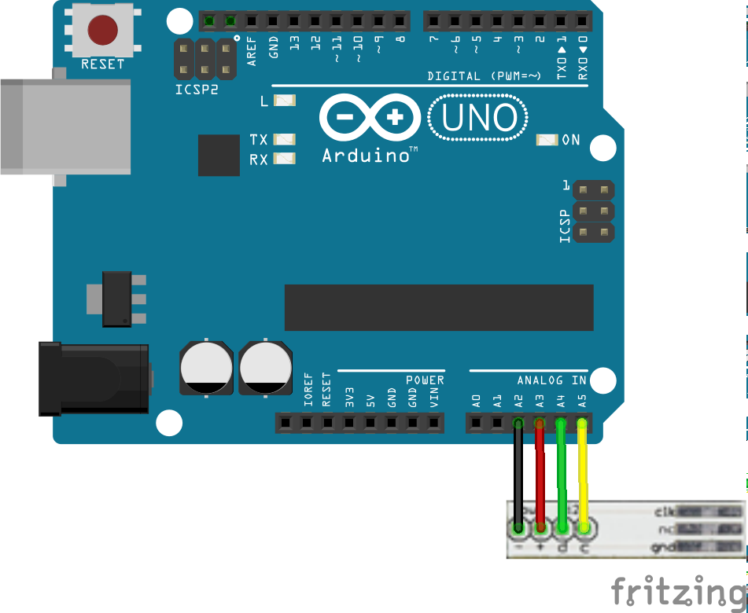

## Ejemplo WiiChuck
Este ejemplo usa un componente de muy bajo costo (WiiChuck) para conectar un Nunchuck de Wii a un Arduino.

### Cableado



### Código
```javascript
const five = require('johnny-five');

const board = new five.Board();

board.on('ready', function() {
  
  // Create a new `nunchuk` hardware instance.
  const nunchuk = new five.Wii.Nunchuk({
    freq: 50
  });
  
  new five.Pin("A2").low(); // Ground
  new five.Pin("A3").high(); // 5v
  
  nunchuk.joystick.on('change', function(event) {
    console.log(
      'joystick ' + event.axis,
      event.target[event.axis],
      event.axis, event.direction
    );
  });
  
  nunchuk.accelerometer.on('change', function(event) {
    console.log(
      'accelerometer ' + event.axis,
      event.target[event.axis],
      event.axis, event.direction
    );
  });

  ['down', 'up', 'hold'].forEach(function(type) {
    nunchuk.on(type, function(event) {
      console.log(
        event.target.which + ' is ' + type,

        {
          isUp: event.target.isUp,
          isDown: event.target.isDown
        }
      );
    });
  });
});

```

### Referencia de la API
