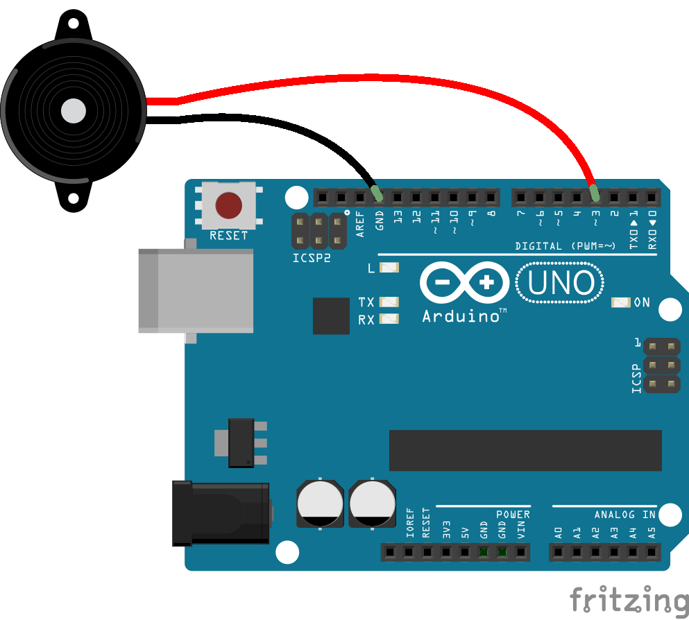

## Ejemplo Piezo / Sonido

### Cableado


### Código
```javascript
const five = require('johnny-five');
const board = new five.Board();

board.on('ready', function onReady() {

  // Create a standard `piezo` instance on pin 3
  const piezo = new five.Piezo(3);

  // Plays a song
  piezo.play({
    // song is composed by an array of pairs of notes and beats
    // The first argument is the note (null means 'no note')
    // The second argument is the length of time (beat) of the note (or non-note)
    song: [
      ['C4', 1 / 4],
      ['D4', 1 / 4],
      ['F4', 1 / 4],
      ['D4', 1 / 4],
      ['A4', 1 / 4],
      [null, 1 / 4],
      ['A4', 1],
      ['G4', 1],
      [null, 1 / 2],
      ['C4', 1 / 4],
      ['D4', 1 / 4],
      ['F4', 1 / 4],
      ['D4', 1 / 4],
      ['G4', 1 / 4],
      [null, 1 / 4],
      ['G4', 1],
      ['F4', 1],
      [null, 1 / 2]
    ],
    tempo: 100
  });
});


```

### Referencia de la API
[Piezo](http://johnny-five.io/api/piezo)