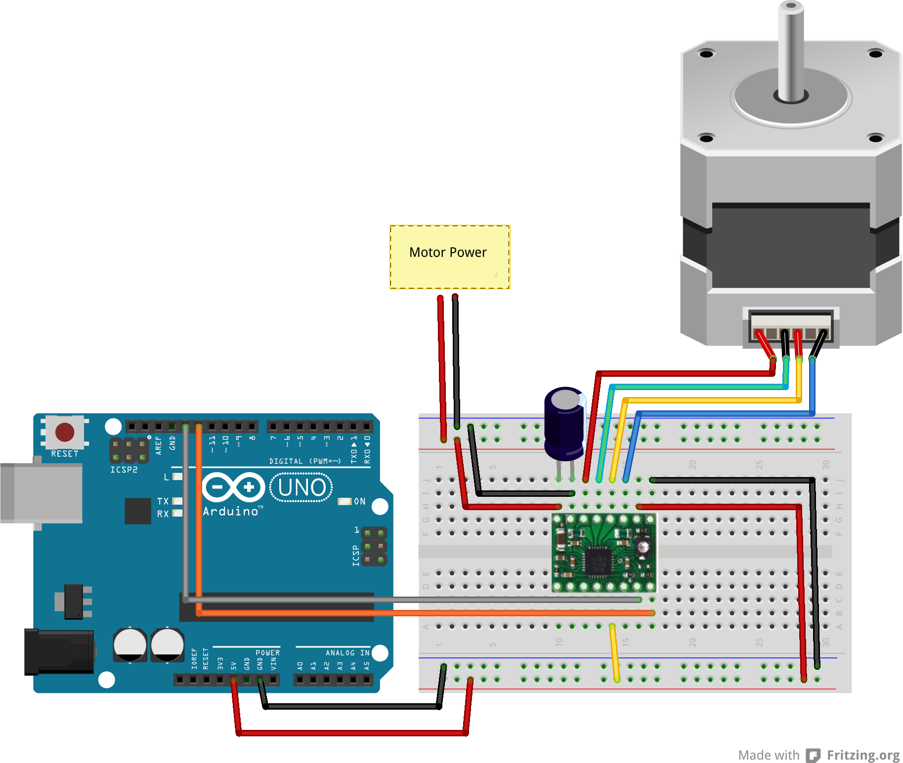

## Ejemplo Motores Paso a Paso

### Cableado


### Código
```javascript
const five = require('johnny-five');
const board = new five.Board();

board.on('ready', function onReady() {

  /**
   * In order to use the Stepper class, your board must be flashed with
   * either of the following:
   *
   * - AdvancedFirmata https://github.com/soundanalogous/AdvancedFirmata
   * - ConfigurableFirmata https://github.com/firmata/arduino/releases/tag/v2.6.2
   *
   */

  const stepper = new five.Stepper({
    type: five.Stepper.TYPE.DRIVER,
    stepsPerRev: 200,
    pins: {
      step: 11,
      dir: 13
    }
  });

  // Make 10 full revolutions counter-clockwise at 180 rpm with acceleration and deceleration
  stepper.rpm(180).ccw().accel(1600).decel(1600).step(2000, function step() {

    console.log('Done moving CCW');

    // once first movement is done, make 10 revolutions clockwise at previously
    //      defined speed, accel, and decel by passing an object into stepper.step

    stepper.step({
      steps: 2000,
      direction: five.Stepper.DIRECTION.CW
    }, function cb() {
      console.log('Done moving CW');
    });
  });
});
```

### Referencia de la API
[Motor](http://johnny-five.io/api/motor)
[Stepper](http://johnny-five.io/api/stepper)